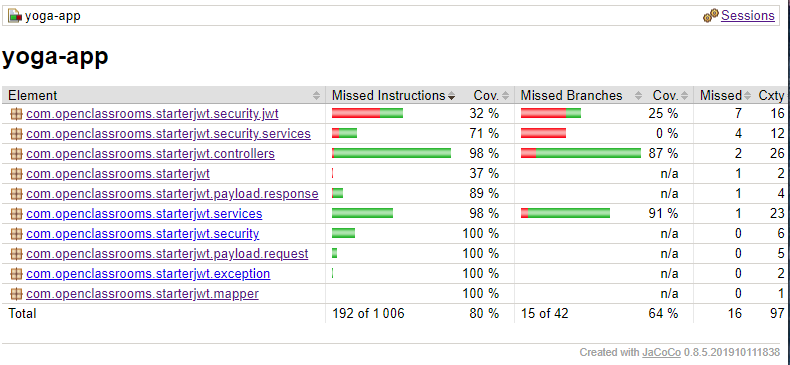

# Formation développeur full-stack Java/Angular - Projet 5 - Clément PASSET

## Introduction

Le but de ce projet est de réaliser les tests unitaires et d'intégration, pour la partie front-end et back-end de l'application.
Également, des tests End-To-End sont réalisés dans le cadre du projet
Ce fichier décrit les étapes à suivre pour pouvoir lancer le projet et les tests associés

## Cloner le repository git

Pour cloner ce repository, il faudra lancer la commande suivante :

`git clone git@github.com:ClementPasset/DFSJA_Projet5.git`

Puis se rendre dans le dossier créé par cette commande :

`cd DFSJA_Projet5`

## Mise en place de la base de données

Après avoir créé la base de données et un utilisateur ayant accès à cette base de données, il faudra la paramétrer.

Pour ça, on aura besoin des variables d'environnement suivantes :

spring.datasource.url -> Contient l'URL vers la base de données
spring.datasource.username -> Contient le nom d'utilisateur de l'utilisateur qui a accès à la base de données
spring.datasource.password -> Contient le mot de passe de cet utilisateur

À la racine du projet, on trouvere le fichier ressources/sql/script.sql
Ce fichier contient les commandes à lancer pour initialiser les tables de la base de données

## Lancer les tests et construire le back-end

Il faut d'abord se rendre dans le dossier back/ si ce n'est pas déjà le cas, puis lancer la commande `mvn clean verify`.
Cette commande va lancer les tests unitaires et les tests d'intégration avant de contruire l'application.

## Lancer l'application back-end

Le .jar sera créé grâce à la commande précédente dans le dossier target/, il faudra donc l'exécuter :
`java -jar target/yoga-app-0.0.1-SNAPSHOT.jar`

## Installer les dépendances du front-end

Pour ça, il faudra se rendre dans le dossier front/
Si vous êtes à la racine du proet : `cd front/`
Si vous êtes dans le dossier back/ : `cd ../front/`

Puis il faudra lancer la commande `npm install` ou le raccourcis `npm i`

## Lancer les tests front-end

Pour lancer les tests unitaires et d'intégration du front-end, deux possibilités :

- `npm run test` pour simplement lancer les tests ;
- `npm run test:coverage` pour lancer les tests et générer le rapport de couverture.

Pour lancer les tests End-To-End en arrière plan, en générant le rapport de couverture :
`npm run e2e:ci && npm run e2e:coverage`

## Lancer l'application front-end

Si vous souhaitez lancer le serveur de développement pour tester l'application manuellement, c'est possible :
`ng serve` ou `npm run start`

## Rapports de couverture

Précédemment nous avons lancé des commandes qui ont permis de générer des rapports de couverture.
Ces différents rapports se trouvent aux emplacements suivants :
- back/target/site/jacoco/index.html : Rapport de couverture des tests unitaires et d'intégration back-end
- front/coverage/jest/lcov-report/index.html : Rapport de couverture des tests unitaires et d'intégration front-end
- front/coverage/lcov-report/index.html : Rapport de couverture des tests End-To-End

## JaCoCo coverage report

## Jest coverage report

## Cypress coverage report
